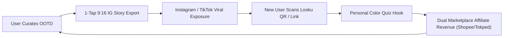

# 📑 Product Requirements Document (PRD)
## Project: look.u AI — Autonomous Tropical & Modest Personal Stylist Platform
**Version:** 2.0-Enterprise  
**Status:** Approved & Living Document  
**Target Market:** Indonesia & Southeast Asia (Tropical Climate, Modest & Streetwear Fashion)

---

## 1. Executive Summary & Vision Statement

### 1.1 The Core Problem (The "Decision Fatigue" & "Climate Mismatch" Epidemic)
Every morning, over 65 million urban Indonesians face acute decision fatigue asking *"Hari ini pakai baju apa?"*. This friction is exacerbated by three unsolved regional pain points:
1. **Tropical Climate Mismatch (33°C–35°C with 80%+ Humidity)**: Fast fashion algorithms from Western/East Asian apps constantly recommend heavy polyester, thick layerings, and non-breathable fabrics that cause heat discomfort in Jakarta, Surabaya, Medan, or Bandung.
2. **Skin Undertone Washout**: 78% of Indonesian consumers (predominantly *Sawo Matang* & *Kuning Langsat*) buy clothes based on model photos that end up clashing with their natural undertone, making their skin look dull or washed out.
3. **Modest & Hijab Friction**: Hijabi women spend 2x more time calculating collar heights, sleeve transparencies, and color harmony between hijab voal and outfit pieces.

### 1.2 The North Star Vision
**look.u AI** is the **first Autonomous AI Personal Stylist & Zero-Friction Wardrobe Ecosystem built ground-up for Southeast Asia**. It transforms how people dress by combining **real-time climate telemetry**, **60-second non-invasive personal colorimetry**, and **1-tap dual marketplace fulfillment (Shopee & Tokopedia)** into an editorial Seoul/Tokyo atelier experience.

---

## 2. Target User Personas & Mental Models

```
┌───────────────────────────────┬───────────────────────────────┬───────────────────────────────┐
│ Persona A: "The Campus Nomad" │ Persona B: "Corporate Modest" │ Persona C: "Weekend Aesthetic"│
├───────────────────────────────┼───────────────────────────────┼───────────────────────────────┤
│ • Name: Nisa (21 thn, Depok)  │ • Name: Sarah (27 thn, SCBD)  │ • Name: Dimas (24 thn, Jaksel)│
│ • Daily Temp: 34°C (KRL Comm) │ • Daily Temp: 20°C AC vs 33°C │ • Daily Temp: Cafe hopping    │
│ • Budget: < Rp 150rb / piece  │ • Budget: Rp 300rb - 800rb    │ • Budget: Mid-tier Local Brand│
│ • Need: Hijab adem, no sweat  │ • Need: Smart casual meeting  │ • Need: Minimalist Clean Fit  │
│   stains, KRL transit-proof.  │   transitioning to dinner.    │   for IG Story & social proof.│
└───────────────────────────────┴───────────────────────────────┴───────────────────────────────┘
```

---

## 3. Breakthrough & "Crazy Good" Feature Roadmap (Innovation Matrix)

### 3.1 Pillar 1: Autonomous Climate-Adaptive Style Engine
* **Real-time GPS Microclimate Telemetry**: Integrates live ambient temperature, UV index, and precipitation forecast.
* **Radical Innovation — "Sweat-Stain Resistance Scoring" (SSRS)**: AI filters out garment weaves and dyes that show sweat marks under 33°C heat, prioritizing high-wicking fabrics like Rayon Twill, Linen Euro, Crinkle Airflow, and Combed 24s.

### 3.2 Pillar 2: 60-Second Personal Color Diagnostic Engine
* **Non-Invasive Vein & Jewelry Heuristics**: Diagnostic algorithm mapping veins (Green/Blue/Purple) and UV skin reaction to determine the 5 Nusantara skin profiles (*Putih Gading, Kuning Langsat, Sawo Matang, Eksotis, Deep Bronze*).
* **Harmonized Contrast Matrix**: Recommends 4 power colors and explicitly flags 2 "Washed-Out" hazard colors per user.

### 3.3 Pillar 3: Digital Capsule Wardrobe & Cost-Per-Wear (CPW) Intelligence
* **Virtual Wardrobe Graph**: Users can mark pieces as `"Milik Sendiri (Owned)"` or `"Wishlist"`.
* **Zero-Waste Re-Mix Algorithm**: When generating new OOTDs, the AI preferentially re-uses 60% of clothing items already in the user's wardrobe, outputting a calculated **Anti-Waste Efficiency Index**.

### 3.4 Pillar 4: Dual Marketplace Instant Fulfillment Arbitrage
* **Shopee & Tokopedia Side-by-Side 50%-50% Integration**: Eliminates platform bias.
* **Tiered Dynamic Pricing**:
  * *Hemat Mahasiswa Tier*: Star+ Seller (< Rp 120.000)
  * *Official Mall Tier*: Verified Official Store (Rp 200.000 - Rp 500.000)

### 3.5 Pillar 5 (Radical Horizon): Real-Time AI Dupe & Camera Scan
* **Influencer Outfit Duplication ("Dupe Engine")**: Users paste any TikTok/Instagram Reel link; computer vision breaks down the look into 4 local marketplace equivalents with a combined price under Rp 350.000.
* **Zero-Storage Privacy-First Camera**: Flatlay and selfie processing executed on ephemeral edge memory—no user images stored permanently.

---

## 4. Viral Growth Loops & Monetization Model



### 4.1 Revenue Architecture:
1. **Marketplace Affiliate Commissions**: 3% - 10% on every outbound purchase via Shopee Affiliate Program & Tokopedia Affiliate Network.
2. **Local Brand Brand-Takeover & Sponsored Capsule**: Featured slot on "Look of the Day" for Indonesian fashion labels (e.g. Erigo, Cottonink, Executive, Buttonscarves).
3. **VIP Pro Stylist Subscription**: Advanced AI stylist voice consulting, unlimited wardrobe cloud backup, and early drop alerts.

---

## 5. Success Metrics & Key Performance Indicators (KPIs)

* **North Star Metric**: **Weekly Active Outfit Decisions (WAOD)** — number of unique days a user selects or saves an outfit formula.
* **Affiliate Click-Through Rate (CTR)**: Target > 14.5% on product cards.
* **Story Share Conversion**: Target > 8% of curated outfits exported to Instagram Stories.
* **PWA Retention (D30)**: Target > 28% for users with saved wardrobe items.
