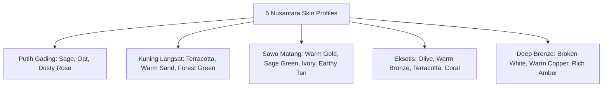

# 🎨 Design System & Visual Philosophy (Design Bible)
## Project: look.u AI — Atelier Neo-Seoul & Tokyo Minimalist System
**Aesthetic Core:** Quiet Luxury Meets Indonesian Tropical Functionality (Editorial Lookbook)

---

## 1. Design Philosophy: "Atelier Neo-Seoul & Tokyo"

look.u rejects the generic, flashy, and cluttered aesthetics of mass-market ecommerce apps. Instead, the interface draws inspiration from **Seoul (Hannam-dong / Seongsu-dong) and Tokyo (Daikanyama / Aoyama) fashion ateliers**:
* **High Breathing Space (Editorial Whitespace)**: Generous paddings and margins allowing fashion photography and color swatches to breathe.
* **Tactile Multi-Layer Depth**: Subtle, natural shadows (`shadow-tactile: 0 4px 20px -2px rgba(24, 26, 24, 0.04)`) instead of heavy artificial drop-shadows.
* **Delicate Micro-Badging**: Discrete spec numbers (`P.01`, `P.02`, `100% Rayon`) that inform without shouting.

---

## 2. Master Color Palette & Semantic Tokens

```
┌─────────────────┬───────────┬────────────────────────────────────────────────────────┐
│ TOKEN NAME      │ HEX CODE  │ SEMANTIC USAGE                                         │
├─────────────────┼───────────┼────────────────────────────────────────────────────────┤
│ Sand 50         │ #FAF8F5   │ Primary canvas background (warm paper texture)         │
│ Sand 100        │ #F4EFE6   │ Secondary surfaces, chip backgrounds, muted cards      │
│ Sand 200        │ #E8DFD1   │ Subtle structural dividers and hairline borders        │
│ Sand 300        │ #D7CABC   │ Active borders, input boundaries, focus rings          │
├─────────────────┼───────────┼────────────────────────────────────────────────────────┤
│ Charcoal 900    │ #181A18   │ Primary high-contrast text, dominant primary CTA       │
│ Charcoal 700    │ #2B2D2A   │ Secondary editorial subheadings                        │
├─────────────────┼───────────┼────────────────────────────────────────────────────────┤
│ Terracotta 500  │ #BA5D38   │ Brand accent, active indicator pills, signature dot    │
│ Terracotta 50   │ #FDF6F3   │ Highlight tint badges, color harmony cards             │
├─────────────────┼───────────┼────────────────────────────────────────────────────────┤
│ Sage / Olive    │ #84A98C   │ Eco/Breathable fabric indicators, Modest friendly tag  │
│ Shopee Orange   │ #EE4D2D   │ Official Shopee marketplace fulfillment button         │
│ Tokopedia Green │ #00AA5B   │ Official Tokopedia marketplace fulfillment button      │
│ Gold VIP        │ #F59E0B   │ VIP Early Access badge (Always paired with #2D1B00 text│
└─────────────────┴───────────┴────────────────────────────────────────────────────────┘
```

---

## 3. Indonesian Skin Tone Colorimetric Matrix



---

## 4. Typography Hierarchy & Font Pairing

1. **Editorial Serif (`Playfair Display / Serif Bold & Italic`)**:
   * Usage: Headlines (`H1`, `H2`), Lookbook titles, Brand logo (`look.u`).
   * Personality: Timeless, sophisticated, human-crafted.
2. **Contemporary Sans (`Plus Jakarta Sans / Inter`)**:
   * Usage: Body copy, feature descriptions, form inputs.
   * Weight: `Regular (400)` and `SemiBold (600)` with `line-height: 1.6`.
3. **Curator Monospace (`JetBrains Mono / Font-Mono`)**:
   * Usage: Product spec sheets (`P.01 • ATASAN`), fabric composition badges, weather telemetry (`33°C Panas Terik`).
   * Tracking: `tracking-wider` / `tracking-widest` uppercase.

---

## 5. Accessibility & WCAG 2.1 AAA Rules

* **Text Contrast**: All body copy and subheadings must maintain a minimum contrast ratio of **>= 7:1 (WCAG AAA)** against background surfaces.
* **No White-on-Yellow/Gold**: VIP and gold elements must always use high-contrast dark brown/black typography (`text-amber-950` / `text-charcoal-900`).
* **Ergonomic Touch Targets**: All interactive elements (buttons, filter pills, input fields, accordion headers) must satisfy a minimum height of **44px** (46px recommended on mobile).

---

## 6. Motion & Tactile Physics (Framer Motion)

* **Spring Curve**: Transitions use organic spring damping:
  ```typescript
  transition: { type: "spring", stiffness: 350, damping: 28 }
  ```
* **Accessible Reduced Motion**: Strictly supports `@media (prefers-reduced-motion: reduce)` to disable heavy animations for sensitive users.
* **Zero Infinite GPU Blur Loops**: Replaced all animated heavy blur filters with static GPU-friendly ambient gradients to prevent mobile throttling.
