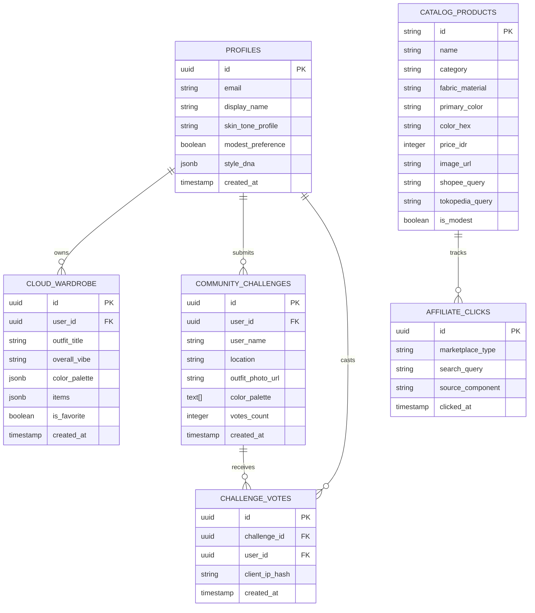

# 🗄️ Database Schema & Data Models Specification
## Project: look.u AI Platform
**Engine:** PostgreSQL 15 (Supabase) • Row-Level Security (RLS) • LocalStorage Cache

---

## 1. Entity Relationship Diagram (ERD)



---

## 2. Table Specifications & Security (RLS)

### 2.1 Table: `profiles`
* Stores user preferences, diagnosed skin undertone, and personalized style DNA.
* **RLS Policy**: Users can only view and update their own profile (`auth.uid() = id`).

### 2.2 Table: `cloud_wardrobe`
* Stores curated OOTD combinations and wardrobe items.
* **Fields**:
  * `id`: `UUID PRIMARY KEY DEFAULT gen_random_uuid()`
  * `user_id`: `UUID REFERENCES auth.users(id) ON DELETE CASCADE`
  * `outfit_title`: `VARCHAR(255) NOT NULL`
  * `overall_vibe`: `VARCHAR(100)`
  * `color_palette`: `JSONB DEFAULT '[]'`
  * `items`: `JSONB DEFAULT '[]'` (Breakdown of Atasan, Bawahan, Hijab/Outer, Sepatu)
  * `created_at`: `TIMESTAMPTZ DEFAULT now()`
* **Indexes**: `CREATE INDEX idx_wardrobe_user ON cloud_wardrobe(user_id);`

### 2.3 Table: `community_challenges` & `challenge_votes`
* **Anti-Fraud Mechanism**: `CHALLENGE_VOTES` enforces a `UNIQUE(challenge_id, user_id)` constraint to prevent vote stuffing. For anonymous voters, `client_ip_hash` enforces a 24-hour rate limit.

### 2.4 Table: `affiliate_clicks`
* Telemetry ledger tracking outbound affiliate redirects to Shopee and Tokopedia for commission reconciliation.

---

## 3. TypeScript Interface Mappings (`src/lib/types.ts`)

```typescript
export type SkinToneId = "fair" | "light" | "medium" | "tan" | "deep";
export type OccasionType = "kuliah" | "kantor" | "kafe" | "kondangan" | "santai" | "travel";
export type BudgetTier = "hemat" | "menengah" | "sultan";

export interface OutfitItem {
  name: string;
  category: "atasan" | "bawahan" | "outer_hijab" | "sepatu" | "aksesoris";
  color: string;
  colorHex?: string;
  material: string;
  estimatedPrice: string;
  shopeeQuery: string;
  isOwnedItem?: boolean;
}

export interface OOTDRecommendation {
  id: string;
  title: string;
  tagline: string;
  overallVibe: string;
  comfortRating: number;
  affordabilityRating: number;
  modestFriendly: boolean;
  skinToneMatch: string;
  whyItWorks: string;
  stylingTip: string;
  colorPalette: { name: string; hex: string }[];
  items: OutfitItem[];
  flatlayImages?: string[];
  createdAt?: string;
}
```
